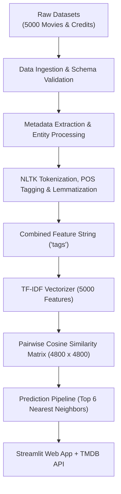

# 🎬 Movie Recommender System

[](https://movie-recommender-system-p8et.onrender.com)
[](https://www.python.org/)
[](https://scikit-learn.org/)
[](https://www.nltk.org/)
[](https://github.com/astral-sh/uv)
[](https://www.themoviedb.org/)

An end-to-end, content-based movie recommendation platform built with **Python**, **Scikit-Learn**, and **Streamlit**. Select any movie from a database of ~4,800 titles to instantly receive the **top 6 most relevant movie recommendations**, enriched with live high-resolution posters, genres, ratings, and synopses from **The Movie Database (TMDB) API**.

---

## 📑 Table of Contents

- [Overview](#-overview)
- [Key Features](#-key-features)
- [How It Works](#-how-it-works)
  - [Machine Learning Workflow](#machine-learning-workflow)
  - [NLP & Feature Engineering](#nlp--feature-engineering)
- [Tech Stack](#-tech-stack)
- [Project Structure](#-project-structure)
- [Getting Started](#-getting-started)
  - [Prerequisites](#prerequisites)
  - [Installation](#installation)
  - [TMDB API Token Setup](#tmdb-api-token-setup)
  - [Run the Web Application](#run-the-web-application)
- [Model Training & Pipeline Execution](#-model-training--pipeline-execution)
- [Design & Resilience](#-design--resilience)
- [Limitations & Future Improvements](#-limitations--future-improvements)
- [Author & Acknowledgments](#-author--acknowledgments)

---

## 🌟 Overview

Traditional collaborative filtering recommendation engines often suffer from the cold-start problem when user interaction data is sparse. This system implements an intelligent **content-based filtering engine** trained on the [TMDB 5000 Movies & Credits dataset](https://www.kaggle.com/datasets/tmdb/tmdb-movie-metadata).

By parsing and blending movie storylines, genres, directors, leading cast members, and plot keywords into high-dimensional vector representations, the system calculates semantic cosine similarity to recommend movies with closely matched themes and creative DNA.

---

## ✨ Key Features

- **🔍 Searchable Catalog (4,800+ Movies)**: Instant dropdown search with clean alphabetic sorting and sanitized movie titles.
- **🎯 Top-6 Precision Recommendations**: Fast, sub-second nearest-neighbor similarity querying powered by precomputed sparse cosine similarity.
- **🖼️ Rich Multimedia Display**: Responsive movie cards presenting TMDB poster art, release year, and star rating.
- **📄 Interactive Movie Details View**: Dedicated view displaying movie overview, runtime, full genre list, and direct links to the TMDB page.
- **🛡️ Resilient API Client**: Robust TMDB API layer featuring connection pooling, automatic retries with exponential backoff on HTTP 429/5xx, fallback poster discovery, and server-side image caching.
- **⚡ Fast Startup & Caching**: Streamlit resource and data caching (`@st.cache_resource`, `@st.cache_data`) for instantaneous subsequent queries and zero redundant network overhead.

---

## 🧠 How It Works

### Machine Learning Workflow



### NLP & Feature Engineering

1. **Entity Merging & Cleaning**:
   - JSON-encoded fields (`genres`, `keywords`, `cast`, `crew`) are deserialized.
   - For `cast`, the top 8 actors are extracted.
   - For `crew`, the primary director is extracted.
   - Whitespace in entities is stripped (e.g., `"Christopher Nolan"` $\rightarrow$ `"ChristopherNolan"`) to guarantee distinct token identities during vectorization.

2. **Combined Tag Composition**:
   - Every movie is transformed into a rich descriptive document:
     $$\text{tags} = \text{overview} + \text{genres} + \text{keywords} + \text{cast} + \text{crew} + \text{title}$$

3. **Linguistic Normalization (NLTK)**:
   - Text is tokenized and stripped of English stop words.
   - Part-of-speech (POS) tags are computed dynamically to enable accurate WordNet lemmatization (nouns, verbs, adjectives, adverbs).

4. **Vectorization & Similarity**:
   - The corpus is vectorized using `TfidfVectorizer` (top 5,000 features, English stop words removed).
   - A cosine similarity matrix is computed:
     $$\text{Cosine Similarity}(\mathbf{A}, \mathbf{B}) = \frac{\mathbf{A} \cdot \mathbf{B}}{\|\mathbf{A}\|_2 \|\mathbf{B}\|_2}$$
   - Precomputed matrices and metadata are persisted into the `artifacts/` directory.

---

## 🛠️ Tech Stack

| Domain | Technologies & Libraries |
| :--- | :--- |
| **Language & Environment** | Python 3.14, [uv](https://github.com/astral-sh/uv) (package management & virtualenvs) |
| **Machine Learning & NLP** | `scikit-learn`, `nltk`, `pandas`, `numpy` |
| **Frontend UI** | `streamlit` |
| **External APIs & Networking**| `requests`, `urllib3`, TMDB API v3 |
| **Model Serialization** | `pickle` |

---

## 📁 Project Structure

```text
Movie-Recommender-System/
├── app.py                                # Streamlit frontend application
├── artifacts/                            # Serialized ML artifacts
│   ├── processed_df.pkl                  # Cleaned movie metadata with tags
│   ├── similarity_matrix.pkl             # Precomputed cosine similarity matrix (~92MB)
│   └── tfidf.pkl                         # Fitted TF-IDF vectorizer model
├── data/
│   └── raw/                              # Original TMDB 5000 datasets
│       ├── tmdb_5000_credits.csv
│       └── tmdb_5000_movies.csv
├── notebook/
│   └── movie_recommender.ipynb           # EDA, prototype modeling, and experimentation
├── src/
│   └── movie_recommender_system/
│       ├── __init__.py
│       ├── exception.py                  # Custom exception wrapper with traceback info
│       ├── logger.py                     # Centralized project logger
│       ├── tmdb_api.py                   # TMDB API handler (retries, cache, poster fallback)
│       ├── utils.py                      # File I/O and object persistence helpers
│       ├── components/
│       │   ├── __init__.py
│       │   ├── data_ingestion.py         # CSV loading, validation, and merging
│       │   ├── data_preprocessing.py     # JSON parsing, entity cleaning & NLP lemmatization
│       │   └── model_trainer.py          # TF-IDF fitting and similarity matrix computation
│       └── pipeline/
│           ├── __init__.py
│           ├── training_pipeline.py      # End-to-end training and artifact generation
│           └── prediction_pipeline.py    # Inference engine to fetch top-K recommendations
├── pyproject.toml                        # Project metadata and dependencies
├── uv.lock                               # Locked dependency graph
└── README.md
```

---

## 🚀 Getting Started

### Prerequisites

- **Python 3.10+** (Python 3.14 supported)
- [uv](https://github.com/astral-sh/uv) recommended (or standard `pip`)
- A free **TMDB API Read Access Token** (v3/v4 API) from [The Movie Database](https://www.themoviedb.org/settings/api)

### Installation

1. **Clone the repository:**
   ```bash
   git clone https://github.com/sahiil444/movie-recommender-system.git
   cd movie-recommender-system
   ```

2. **Install dependencies:**

   Using **`uv`** (recommended):
   ```bash
   uv sync
   ```

   *Alternatively, using standard `pip`:*
   ```bash
   python -m venv .venv
   source .venv/bin/activate  # On Windows: .venv\Scripts\activate
   pip install -e .
   ```

### TMDB API Token Setup

1. Obtain a **Read Access Token** from your [TMDB Account Settings](https://www.themoviedb.org/settings/api).
2. Create or edit the Streamlit secrets configuration at `.streamlit/secrets.toml`:
   ```toml
   TMDB_API_READ_ACCESS_TOKEN = "your_tmdb_read_access_token_here"
   ```
   *(Alternatively, export it as an environment variable: `export TMDB_API_READ_ACCESS_TOKEN="your_token"`)*

### Run the Web Application

Launch the Streamlit web app:

```bash
# Using uv:
uv run streamlit run app.py

# Or directly in your activated environment:
streamlit run app.py
```

Open your browser at `http://localhost:8501`.

---

## ⚙️ Model Training & Pipeline Execution

The precomputed artifacts are already included in the [`artifacts/`](artifacts) folder. However, if you wish to retrain the model or update the raw dataset:

1. **Download required NLTK corpora:**
   ```python
   import nltk
   nltk.download(["stopwords", "wordnet", "punkt", "averaged_perceptron_tagger"])
   ```

2. **Trigger the training pipeline:**
   ```bash
   python -c "from src.movie_recommender_system.pipeline.training_pipeline import run_training_pipeline; run_training_pipeline()"
   ```
   This will regenerate and overwrite `artifacts/processed_df.pkl`, `artifacts/tfidf.pkl`, and `artifacts/similarity_matrix.pkl`.

---

## 🛡️ Design & Resilience

- **Fail-Safe Poster Discovery**: If the primary `/movie/{id}` endpoint lacks a poster path, the app automatically inspects the `/movie/{id}/images` endpoint, prioritising English and language-neutral posters.
- **Network Resilience**: Custom HTTP adapters manage retries with exponential backoffs against rate limits (HTTP 429) or temporary server dropouts.
- **Backend Byte Streaming**: Movie posters are fetched server-side into bytes and cached, preventing client-side CDN blockages or broken image links.
- **Graceful Error Handling**: Custom exceptions ([`CustomException`](src/movie_recommender_system/exception.py)) log file names and line numbers for easy debugging while displaying clean, user-friendly messages on the frontend.

---

## 📌 Limitations & Future Improvements

- **Purely Content-Based**: Currently does not incorporate user-specific collaborative filtering or session history.
- **Catalog Size**: Fixed to the TMDB 5000 dataset (~4,800 titles). Expanding to dynamic TMDB database queries would increase variety.
- **Hybrid Recommendations**: Future releases could combine content-based TF-IDF with user ratings and matrix factorization (SVD / Neural Collaborative Filtering).

---

## 👤 Author & Acknowledgments

- **Author**: Abdul Sahil ([@sahiil444](https://github.com/sahiil444))
- **Dataset**: [TMDB 5000 Movie Dataset](https://www.kaggle.com/datasets/tmdb/tmdb-movie-metadata) on Kaggle
- **API**: [The Movie Database (TMDB)](https://www.themoviedb.org/) for movie metadata and poster artwork
